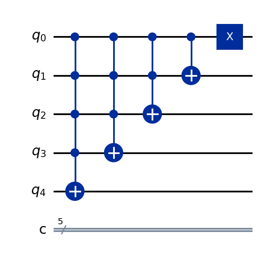
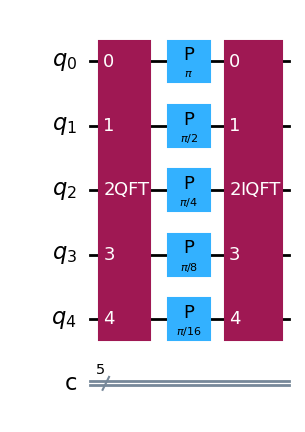
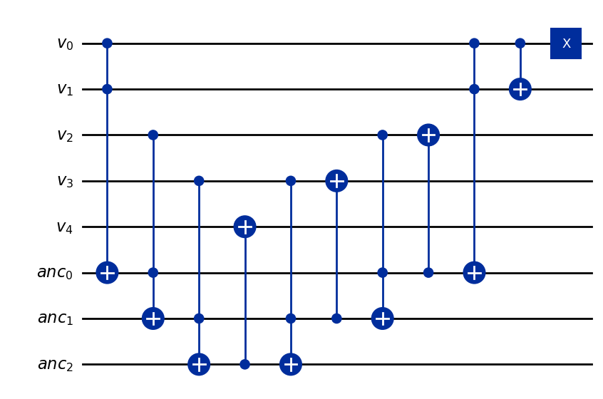

# quantum-hackathon-2026

My entry to the RPI Quantum Hackathon 2026. Challenge category: optimize the rshift (increment) and lshift (decrement) operator quantum circuits.

## Overview

This project studies different quantum circuit implementations of the increment operation, or right shift, and the matching decrement operation. The full experiment is implemented in [increment.ipynb](increment.ipynb).

The notebook compares three increment/decrement circuit families:

- A naive baseline built from multi-controlled `X` gates.
- A QFT-based implementation that uses the Quantum Fourier Transform and phase rotations, with no ancilla qubits.
- A carry-lookahead style implementation that uses `n-2` ancilla qubits.

Each increment circuit is paired with a corresponding decrementor, and the notebook verifies that the two are exact inverses. The experiment also benchmarks circuit metrics across multiple bit widths and evaluates execution fidelity on hardware-backed runs.

## Notebook Workflow

1. Define the three increment and decrement circuit families.
2. Verify that each decrementor is the inverse of its incrementor.
3. Generate and transpile benchmark circuits for a range of input sizes.
4. Run trials, collect measurement results, and compute fidelities.
5. Plot circuit metrics and fidelity comparisons.

## Files

- [increment.ipynb](increment.ipynb): main experiment notebook.
- [database.py](database.py): experiment database models and helpers.
- [plots](plots): generated metric and fidelity plots.

## Background

In classical computing, the increment operation on an N-bit number increases the number by one: 
$$1 \rightarrow 2, 2 \rightarrow 3, \ldots, 2^N-2 \rightarrow 2^N -1$$

The equivalent operation in quantum computing $$\ket{x} \rightarrow \ket{(x+1) \mod 2^N}$$ is the one that shfits every entry in the statevector by one.
The following matrix performs the increment (also called right shift) operation on a statevector:
$$P = \begin{pmatrix} 0 & 0 & \dots & 1 \\ 1 & 0 & \dots & 0 \\ 0 & 1 & \dots & 0 \\ \vdots & \vdots & \ddots & \vdots \end{pmatrix}$$

##### Naive Incrementor
One way to perform the increment is to compute the carry for each bit separately, starting with the most significant bit (MSB) and applying a controlled not (CX) if a carry occurs at that bit. Each bit has a carry if and only if all the previous bits are set in the input (except the least significant bit which has a carry every time by the incrementing operation). A circuit that performs this operation is shown below, in which a multiply-controled not is used to increment each bit if a carry is present for it.

The problem with this approach is that the multiply-controled not is not suppored in hardware and needs to be decomposed into a series of 1-qubit and 2-qubit gates. A multiply-controlled not with n controlling qubits can be decomposed into $O(n^2)$ CX gates along with other 1-qubit gates. When transpiling the above circuit for RPI's quantum computer, the depth increases to 201, including 55 2-qubit gates (which induce the most error). The fidelity of such a circuit is very low on modern NISQ computers. In this project, we compare alternative implementations of the increment circuit to identify one with lower depth and higher fidelity.

##### Quantum Fourier Transform (QFT) Incrementor
Observe that $P$ is circulant (each column is a rotated version of the first column) which means it is diagonalized by the Discrete Fourier Transform (DFT). 
$$P = F^\dagger D F$$
For any N-qubit statevector, applying the increment operator (P) $2^N$ times must return the state to its original form. We deduce that the eigenvalues are the $2^N$ roots of unity
$$ \lambda_j = e^{2 \pi i j / 2^N} $$
We can rewrite P then
$$
P = F^\dagger 
\begin{pmatrix}
e^{2 \pi i / 2^N} &  &  &  \\ 
 & e^{2 \pi i 2 / 2^N} &  &  \\ 
 &  & \ddots &  \\ 
 &  &  & e^{2 \pi i 2^N / 2^N} 
\end{pmatrix} 
F
$$

The Discrete Fourier Transform is a unitary operation and its well known quantum version is the Quantum Fourier Transform QFT which is available in Qiskit. Our task, then is to create the circuit that implements the diagonal matrix D.

Consider the action of D on some basis statevector $\ket{2^j}$. We want
$$D \ket{2^j} = e^{2 \pi i 2^j / 2^N} \ket{2^j} = e^{2 \pi i/ 2^{N-j}} \ket{2^j}$$
We can achieve this in a quantum circuit by applying a phase of $2 \pi / 2^{N-j}$ to each qubit according to its index j.

Since QFT is provided by Qiskit, we can use the above facts to create an incrementing circuit as the following:
1. Apply QFT
1. Apply Phase gate to each qubit j with angle $2 \pi / 2^{N-j}$
1. Apply Inverse QFT

To produce the inverse operation (decrement) we can do the same thing but with a small change
$$ P^\dagger = (F^\dagger D F)^\dagger = F^\dagger D^\dagger F $$
the eigenvalues in $D^\dagger$ are the inverse of the eigenvalues of D and so are $\lambda_j = e^{-2 \pi i j / 2^N}$ which means we just need to negate the phase in each gate in step (2) to perform the decrement operation.

Although this circuit looks elegant at a high level, the QFT and its inverse each decompose into fairly deep, expensive circuits. As we'll see in experiment, this circuit is better than the original, but not much better.

##### Carry Lookahead (CLA) Incrementor
A powerful technique for reducing depth in a quantum circuit is to use ancilla qubits (extra, helper qubits) to store intermediate results. We can leverage ancillas to dramatically improve the naive incrementor implementation. 
Notice how the carry for the 5th bit requires computing the AND of the first 4 bits, the carry for the 4th bit requires computing the AND of the first 3 bits, and so on. So, the AND of bits 1 and 2 is computed as part of the carry for bits 3, 4, and 5. These repeated AND calculations are expensive and can be "cached" using ancilla qubits.

Consider the following circuit:

Although this might not look similar to the original circuit at first, the structure is much the same. Ancilla $anc_0$ stores the AND of the first two bits, $anc_1$ stores the AND of the first three bits (using $anc_0$), and so on. Each ancilla value corresponds with a carry bit. After computing these, the input qubits can be incremented with a single CX controlled by its ancilla. Although this uses $n-2$ extra qubits, the result is a circuit with $O(n)$ 2-qubit depth.

## Results

The notebook collects and compares several circuit metrics, including depth, two-qubit gate count, two-qubit depth, and circuit width, both before and after transpilation. Fidelity is computed from measured outputs by comparing each trial against the expected incremented or decremented result.

The plots in [plots](plots) summarize these results visually. They show the expected tradeoff: the carry-lookahead design achieves the best fidelity, but it requires a wider circuit because of the additional ancillas; the naive baseline is simpler but less efficient; and the QFT-based version sits in between by avoiding ancillas while still improving over the baseline.

### Circuit Metrics

### Fidelity

## References / Further Reading
These articles and papers helped me understand the work that has already been done towards optimizing the incrementor circuit and led to the specific implementations I tried as part of the project:
* [Asymptotically Optimal Quantum Circuits for Comparators and Incrementers](https://arxiv.org/pdf/2603.12917): this is interesting, recent work on the problem. While I did not directly use Vandaele's implementation, the references from this paper were useful to me.
* [Constructing Large Increment Gates](https://algassert.com/circuits/2015/06/12/Constructing-Large-Increment-Gates.html): an excelent article from Craig Gidney which gave me the idea of using a carry lookahead approach.
* [Quantum Incrementer](https://egrettathula.wordpress.com/2024/07/28/quantum-incrementer/): this article by Egretta Thula provides a similar analysis comparing different incrementor circuits as what I've done. Although Thula includes more implementations than I did, there is a lack of empiricle hardware results to support the comparison in the article.