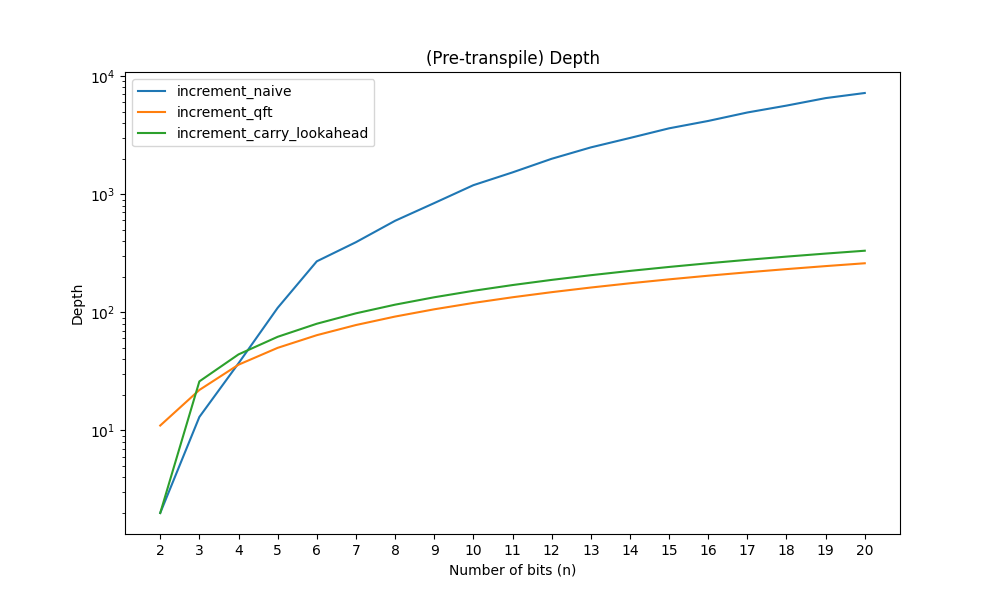
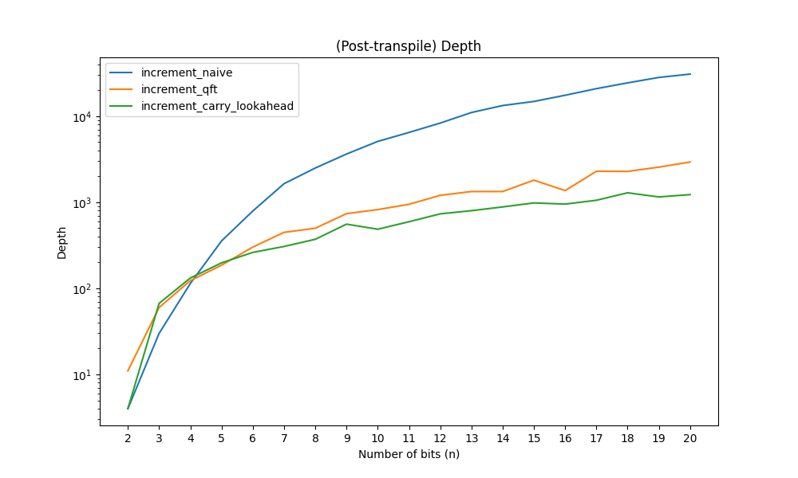
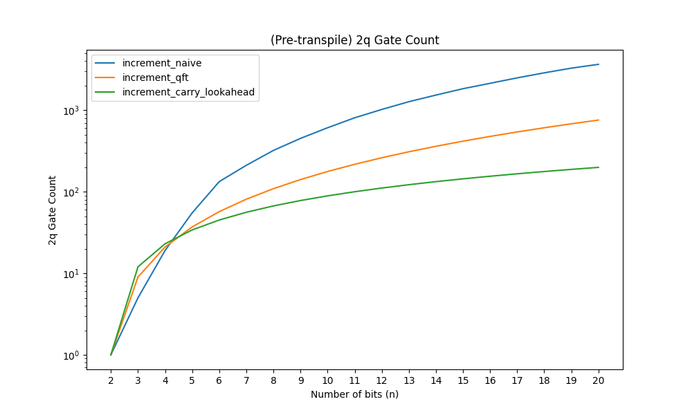
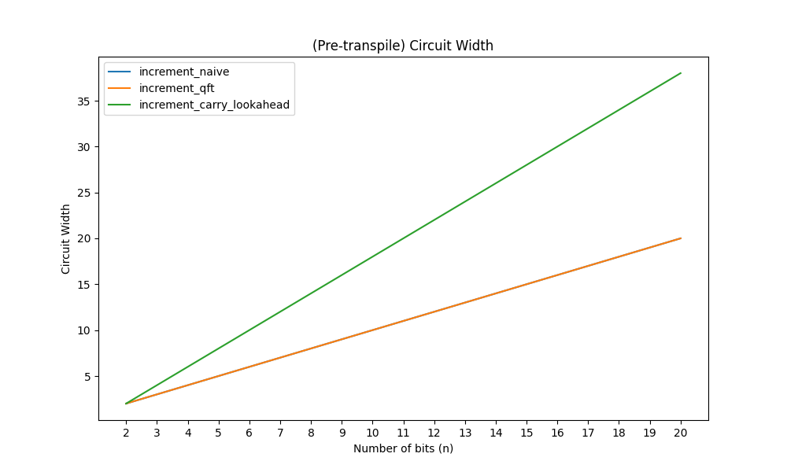
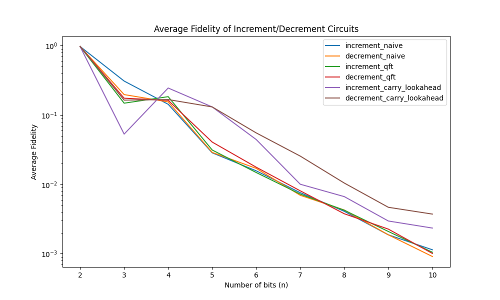

# quantum-hackathon-2026

## Overview

This project studies different quantum circuit implementations of the increment operation, or right shift, and the matching decrement operation. The full experiment is implemented in [increment.ipynb](increment.ipynb).

The notebook compares three increment/decrement circuit families:

- A naive baseline built from multi-controlled `X` gates.
- A QFT-based implementation that uses the Quantum Fourier Transform and phase rotations, with no ancilla qubits.
- A carry-lookahead style implementation that uses `n-2` ancilla qubits.

Each increment circuit is paired with a corresponding decrementor, and the notebook verifies that the two are exact inverses. The experiment also benchmarks circuit metrics across multiple bit widths and evaluates execution fidelity on hardware-backed runs.

## Notebook Workflow

1. Define the three increment and decrement circuit families.
2. Verify that each decrementor is the inverse of its incrementor.
3. Generate and transpile benchmark circuits for a range of input sizes.
4. Run trials, collect measurement results, and compute fidelities.
5. Plot circuit metrics and fidelity comparisons.

## Files

- [increment.ipynb](increment.ipynb): main experiment notebook.
- [database.py](database.py): experiment database models and helpers.
- [plots](plots): generated metric and fidelity plots.

## Background
In classical computing, the increment operation on an N-bit number increases the number by one: 
$$1 \rightarrow 2, 2 \rightarrow 3, \ldots, 2^N-2 \rightarrow 2^N -1$$

The equivalent operation in quantum computing $$\ket{x} \rightarrow \ket{(x+1) \mod 2^N}$$ is the one that shfits every entry in the statevector by one.
The following matrix performs the increment (also called right shift) operation on a statevector:
$$P = \begin{pmatrix} 0 & 0 & \dots & 1 \\ 1 & 0 & \dots & 0 \\ 0 & 1 & \dots & 0 \\ \vdots & \vdots & \ddots & \vdots \end{pmatrix}$$

Importantly, $P$ is circulant which means it is diagonalized by the Discrete Fourier Transform (DFT). 
$$P = F^\dagger D F$$
For any N-qubit statevector, applying the increment operator (P) $2^N$ times must return the state to its original form. We deduce that the eigenvalues are the $2^N$ roots of unity
$$ \lambda_j = e^{2 \pi i j / 2^N} $$
We can rewrite P then
$$
P = F^\dagger 
\begin{pmatrix}
e^{2 \pi i / 2^N} &  &  &  \\ 
 & e^{2 \pi i 2 / 2^N} &  &  \\ 
 &  & \ddots &  \\ 
 &  &  & e^{2 \pi i 2^N / 2^N} 
\end{pmatrix} 
F
$$

The Discrete Fourier Transform is a unitary operation and its well known quantum version is the Quantum Fourier Transform QFT which is available in Qiskit. Our task, then is to create the circuit that implements the diagonal matrix D.

Consider the action of D on some basis statevector $\ket{2^j}$. We want
$$D \ket{2^j} = e^{2 \pi i 2^j / 2^N} \ket{2^j} = e^{2 \pi i/ 2^{N-j}} \ket{2^j}$$
We can achieve this in a quantum circuit by applying a phase of $2 \pi / 2^{N-j}$ to each qubit according to its index j.

Since , provided by Qiskit, we can use the above facts to create an incrementing circuit as the following:
1. Apply QFT
1. Apply Phase gate to each qubit j with angle $2 \pi / 2^{N-j}$
1. Apply Inverse QFT

To produce the inverse operation (decrement) we can do the same thing but with a small change
$$ P^\dagger = (F^\dagger D F)^\dagger = F^\dagger D^\dagger F $$
the eigenvalues in $D^\dagger$ are the inverse of the eigenvalues of D and so are $\lambda_j = e^{-2 \pi i j / 2^N}$ which means we just need to negate the phase in each gate in step (2) to perform the decrement operation.

## Results

The notebook collects and compares several circuit metrics, including depth, two-qubit gate count, two-qubit depth, and circuit width, both before and after transpilation. Fidelity is computed from measured outputs by comparing each trial against the expected incremented or decremented result.

The plots in [plots](plots) summarize these results visually. They show the expected tradeoff: the carry-lookahead design achieves the best fidelity, but it requires a wider circuit because of the additional ancillas; the naive baseline is simpler but less efficient; and the QFT-based version sits in between by avoiding ancillas while still improving over the baseline.

### Circuit Metrics

### Fidelity

